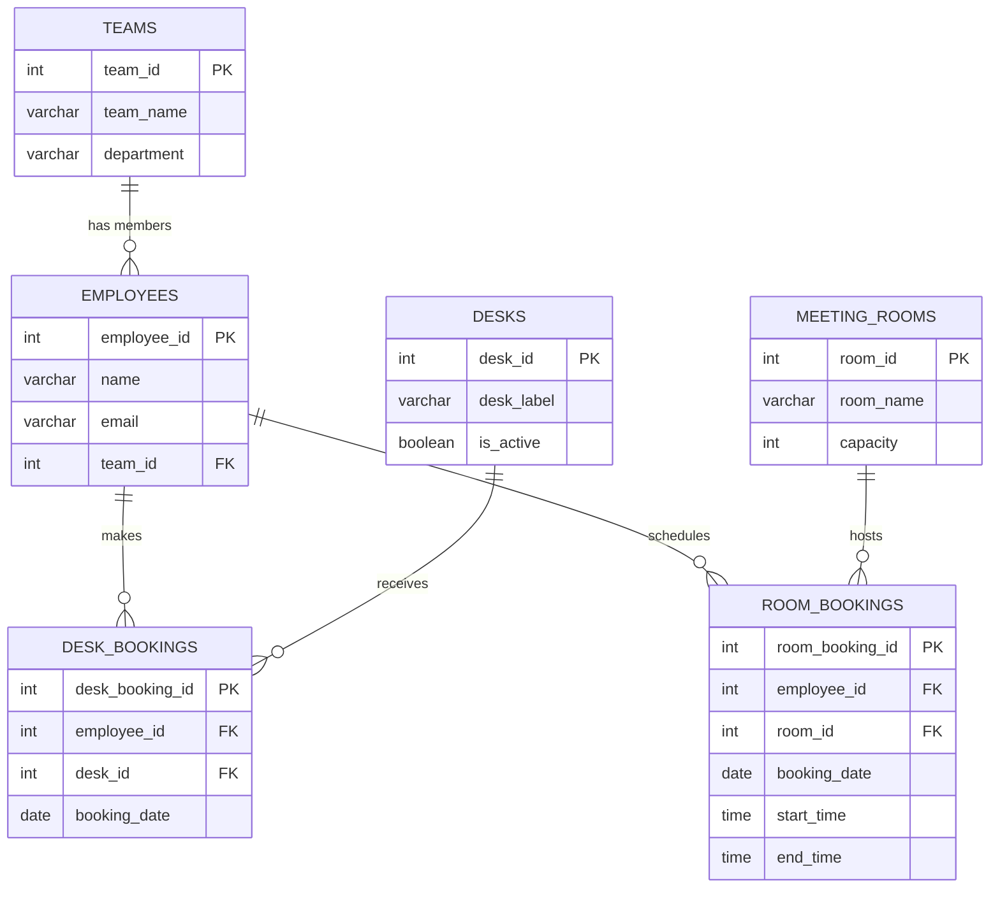

# 🏢 CoSpace Database Schema Design (3NF)

This document outlines the database blueprint for **CoSpace**, the hybrid-working desk and meeting room booking system designed for **BrightMedia**.

---

## 📋 1. Spreadsheet Normalisation Process (1NF to 3NF)

The original administrative spreadsheet was flat, redundant, and highly susceptible to data corruption. Below is the step-by-step normalisation process applied to transition this data into a relational engine.

| Normalisation Stage | Action Taken on BrightMedia Spreadsheet | Architectural Justification |
| :--- | :--- | :--- |
| **First Normal Form (1NF)**<br>*Atomic Values* | **Eliminated Multi-Value Cells**: Individual cells in the `Desk Bookings` and `Booking Dates` columns that previously contained comma-separated lists (e.g., "Desk 12, Desk 45") have been split into individual, atomic rows. | **Eliminates Redundant Lists**: SQL database engines cannot natively perform searches, index, or guarantee referential integrity on unparsed text lists inside a single cell. |
| **Second Normal Form (2NF)**<br>*No Partial Dependencies* | **Isolated Independent Entities**: Every non-key column must depend on the *entire* primary key. <br>• Separated **Employees**, **Teams**, **Meeting Rooms**, and **Desks** into their own distinct tables. <br>• Extracted team departments into a separate `teams` table rather than repeating department names next to every employee. | **Eliminates Update Anomalies**: If the "Engineering" department changes its name, it only needs to be updated in a single row within the `teams` table, rather than across hundreds of employee rows. |
| **Third Normal Form (3NF)**<br>*No Transitive Dependencies* | **Removed Non-Key Dependencies**: Non-key columns must not depend on other non-key columns. <br>• Extracted booking events from both employee profiles and physical desk lists. <br>• Created standalone booking tables so that transactional dates do not dictate or duplicate master data. | **Eliminates Deletion Anomalies**: If a booking is deleted or cancelled, we only remove the transaction row. The physical desk record and the employee's corporate profile remain fully intact. |

---

## 📊 2. Entity Relationship Diagram (ERD)

This diagram utilizes standard **Crow's Foot Notation** to model the relationships between our normalised tables.



---

## 🔑 3. Table Structure & Keys Reference

| Table Name | Primary Key (PK) | Foreign Keys (FK) | Purpose / Description |
| :--- | :--- | :--- | :--- |
| **`teams`** | `team_id` | *None* | Defines business units and departments within BrightMedia. |
| **`employees`** | `employee_id` | `team_id` (references `teams`) | Stores profile details for the 200 employees and maps them to a team. |
| **`desks`** | `desk_id` | *None* | Contains the master registry of the 80 hot-desks available in the office. |
| **`meeting_rooms`** | `room_id` | *None* | Details the 5 physical meeting rooms along with their capacities. |
| **`desk_bookings`** | `desk_booking_id` | `employee_id` (references `employees`), `desk_id` (references `desks`) | **Junction Table**: Records daily reservations of specific physical desks. |
| **`room_bookings`** | `room_booking_id` | `employee_id` (references `employees`), `room_id` (references `meeting_rooms`) | **Junction Table**: Tracks timed bookings for shared meeting spaces. |

---

## 🛡️ 4. The Junction Table Defense

* **The Problem:** An employee books many different desks over several weeks, and a single desk is booked by many different employees on different days. This represents a classic **Many-to-Many (M:N)** relationship. 
* **What Breaks Without It:** 
  * If we added a `desk_id` column directly to the `employees` table, an employee could only store one booking at a time. Booking a desk for tomorrow would permanently overwrite and erase their booking for today.
  * If we added an `employee_id` column directly to the `desks` table, that desk would be permanently locked to a single person. It would fail to support a hybrid hot-desking model.
* **The Solution:** The `desk_bookings` junction table isolates individual booking transactions. It cleanly breaks down the complex M:N relationship into two manageable, independent **One-to-Many (1:N)** relationships.

---

## 💡 5. Safeguarding System Integrity (Showcase Defense)

* **Preventing Double-Booked Desks:** To ensure two people cannot reserve the same desk on the same calendar day, we apply a composite unique database constraint on the `desk_bookings` table:
  ```sql
  UNIQUE(desk_id, booking_date)
  ```
  This instructs the database engine to automatically reject any conflicting reservation attempts at the infrastructure level.
* **Separating Desks and Rooms:** Desks are booked as all-day resources (requiring only a `booking_date`), while meeting rooms are booked for hours or minutes (requiring `start_time` and `end_time`). Separating them into `desk_bookings` and `room_bookings` prevents our database from being cluttered with redundant, empty null values.
